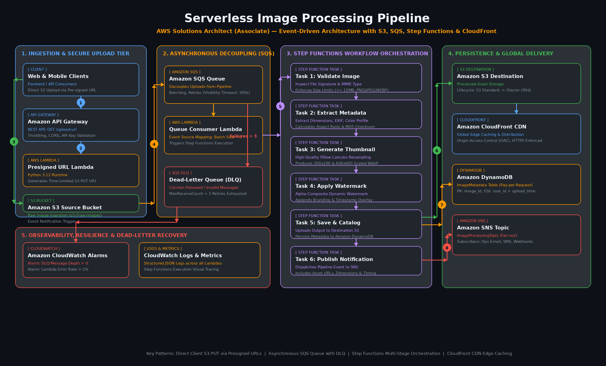

# Serverless Image Processing Pipeline with S3, SQS & Lambda

*An event-driven, production-grade serverless media pipeline on AWS featuring direct S3 uploads via Pre-signed URLs, asynchronous decoupling with Amazon SQS and DLQ, multi-stage workflow orchestration via AWS Step Functions, persistence in DynamoDB, and global edge caching with Amazon CloudFront.*

[](https://aws.amazon.com/certification/certified-solutions-architect-associate/)
[](./docs/02-architecture.md)
[](./cloudformation/)
[](./docs/04-well-architected.md#45-pillar-5-cost-optimization)
[](./LICENSE)

---



> **Editable Diagrams**: The vector SVG version is available at [solution-architecture.svg](./architecture/solution-architecture.svg), and the editable diagrams.net XML specification is available at [solution-architecture.drawio](./architecture/solution-architecture.drawio).

---

## Overview

This project implements **Project 2: Serverless Image Processing Pipeline with S3, SQS & Lambda** from the AWS Solutions Architect – Associate (SAA-C03) curriculum and the Manara graduation project ideas. 

### Why this is the easiest, cleanest, and most robust project to implement:
1. **100% Serverless & Zero Server Management**: Eliminates VPC peering, NAT Gateways, bastions, and OS maintenance.
2. **100% Free Tier Eligible**: Incurs **$0.00/month** idle cost, utilizing generous AWS Free Tier quotas (1M Lambda calls, 1M SQS messages, 25 GB DynamoDB, 1 TB CloudFront).
3. **Instant Visual Verification**: Unlike invisible background jobs, image transformations (thumbnails, watermarks, metadata) are immediately verifiable both in the AWS Console and via the included browser test client.
4. **Comprehensive SAA-C03 Domain Alignment**: Directly exercises core SAA concepts:
   - **Asynchronous Decoupling**: S3 Event Notifications to SQS Queue.
   - **Fault Isolation**: Dead-Letter Queues (DLQ) with automatic redrive policies.
   - **Visual Orchestration**: AWS Step Functions state machine with exponential retries and failure catch blocks.
   - **Direct-to-Object Storage**: S3 Pre-signed URLs bypassing API payload limits.
   - **Global Edge Acceleration**: CloudFront CDN with Origin Access Control (OAC).

---

## Documentation

| # | Document | Scope & Contents |
|---|---|---|
| **01** | [Requirements](./docs/01-requirements.md) | Functional & non-functional requirements, SAA-C03 domain mapping, and boundaries. |
| **02** | [Architecture](./docs/02-architecture.md) | Detailed component breakdowns, 8-step request flow, DynamoDB data schema, and OAC configuration. |
| **03** | [Design Decisions](./docs/03-design-decisions.md) | Architectural Decision Records (ADRs) comparing alternatives and tradeoffs. |
| **04** | [Well-Architected](./docs/04-well-architected.md) | Comprehensive alignment across all 6 AWS Well-Architected Framework pillars. |
| **05** | [Risks & Mitigations](./docs/05-risks.md) | Risk register, poison pill handling, and prevention of recursive S3 invocation storms. |
| **06** | [Future Work (v2)](./docs/06-future-work.md) | Roadmap for Amazon Rekognition moderation and Bedrock multimodal AI captioning. |
| **07** | [Appendix & Runbooks](./docs/07-appendix.md) | AWS service inventory, CloudFormation parameters, least-privilege IAM matrix, and runbooks. |

---

## Repository Layout

```
├── README.md                           # Main project overview and deployment guide
├── LICENSE                             # MIT License
├── CHANGELOG.md                        # Version history and release notes
├── .gitignore                          # Git exclusions
├── architecture/                       # Visual Architecture Diagrams
│   ├── solution-architecture.png       # High-resolution raster diagram (2400x1450)
│   ├── solution-architecture.svg       # Scalable vector graphics diagram
│   └── solution-architecture.drawio    # Native draw.io / diagrams.net XML diagram
├── docs/                               # Formal architectural documentation (01–07)
│   ├── 01-requirements.md
│   ├── 02-architecture.md
│   ├── 03-design-decisions.md
│   ├── 04-well-architected.md
│   ├── 05-risks.md
│   ├── 06-future-work.md
│   └── 07-appendix.md
├── cloudformation/                     # Production Infrastructure as Code (IaC)
│   ├── main-stack.yaml                 # Master nested stack orchestrator
│   ├── standalone-deployment.yaml      # All-in-one template for 1-click deployment
│   ├── 01-storage-queues.yaml          # S3 buckets, SQS queues, DLQ & policies
│   ├── 02-database-notifications.yaml  # DynamoDB metadata catalog & SNS topic
│   ├── 03-iam-roles.yaml               # Least-privilege IAM execution roles
│   ├── 04-step-functions.yaml          # Step Functions state machine ASL
│   ├── 05-lambda-functions.yaml        # Lambda compute & SQS event source mapping
│   ├── 06-api-gateway.yaml             # REST API for pre-signed URLs with CORS & throttling
│   ├── 07-cloudfront.yaml              # CloudFront CDN distribution with OAC
│   └── 08-monitoring.yaml              # CloudWatch alarms & operational dashboard
├── lambda/                             # Modular Python 3.12 Lambda Handlers
│   ├── presigned-url-generator/        # Signs S3 PUT URLs with file-type enforcement
│   ├── sqs-consumer/                   # Polls SQS and launches Step Functions executions
│   ├── image-processor/                # Resizing, metadata extraction & watermarking (Pillow)
│   └── notification-dispatcher/        # Dispatches SNS pipeline alerts
├── step-functions/                     # Orchestration Workflows
│   └── image-processing-workflow.asl.json # Amazon States Language definition
├── client/                             # Interactive Web Demo Client
│   └── index.html                      # Browser upload client with live CloudFront preview
├── tests/                              # Automated Test Suite & Assets
│   ├── test_pipeline.py                # Unit and integration test suite
│   ├── generate_sample_image.py        # Generates test images
│   └── sample-images/                  # Landscape, portrait & square sample assets
└── scripts/                            # Operational Automation
    ├── deploy.sh                       # Automated deployment script (standalone or nested)
    ├── cleanup.sh                      # Safe teardown & versioned bucket emptying script
    ├── test.sh                         # End-to-end verification runner
    └── generate_diagram.py             # Diagram generation script
```

---

## Quick Start & Deployment Guide

### Prerequisites
- [AWS CLI v2](https://docs.aws.amazon.com/cli/latest/userguide/install-cliv2.html) installed and configured (`aws configure`).
- Python 3.10+ (for local test runner and diagram generator).

### Option A: One-Command Automated Deployment (Recommended)
Deploy the entire production infrastructure in 3 minutes:

```bash
chmod +x scripts/*.sh
./scripts/deploy.sh --email your-email@example.com --region us-east-1
```

*(Optional: To deploy via nested multi-stack mode, pass `--mode nested --bucket <your-cfn-templates-bucket>`)*.

### Option B: Deploy via AWS Management Console
1. Navigate to the **AWS CloudFormation Console** in your target region.
2. Click **Create stack** -> **With new resources (standard)**.
3. Upload [`cloudformation/standalone-deployment.yaml`](./cloudformation/standalone-deployment.yaml).
4. Enter your operational alert email in the `NotificationEmail` parameter.
5. Acknowledge IAM capabilities (`CAPABILITY_NAMED_IAM`) and click **Submit**.

---

## Verification & Interactive Demo

### 1. Run Automated Unit Tests
```bash
./scripts/test.sh
```
Output:
```text
================================================================
        SERVERLESS IMAGE PIPELINE TEST & VERIFICATION           
================================================================
[STEP 1] Running Local Unit Tests...
......
----------------------------------------------------------------------
Ran 6 tests in 0.052s

OK
[OK] All local unit tests passed successfully!
```

### 2. Live Cloud End-to-End Test
Once deployed, run the test script with your deployed API Gateway endpoint:
```bash
./scripts/test.sh --api-url https://<api-id>.execute-api.us-east-1.amazonaws.com/prod/upload-url
```

### 3. Interactive Browser Demo Client
Open [`client/index.html`](./client/index.html) in your browser:
1. Paste your API Gateway endpoint URL.
2. Choose any test image from `tests/sample-images/` (or your own photo).
3. Click **Upload & Process Image**.
4. Observe the direct-to-S3 upload and the resulting thumbnail delivered over CloudFront!

---

## Architecture Request Flow Summary

```mermaid
sequenceDiagram
    autonumber
    actor Client as Web / Mobile Client
    participant APIGW as API Gateway
    participant URL_Lambda as Presigned URL Lambda
    participant S3_Raw as S3 Source Bucket
    participant SQS as Amazon SQS Queue
    participant SQS_Lambda as SQS Consumer Lambda
    participant SFN as Step Functions (State Machine)
    participant Worker as Image Processor Lambda
    participant S3_Dest as S3 Destination Bucket
    participant DDB as DynamoDB (Metadata)
    participant CF as CloudFront CDN

    Client->>APIGW: GET /upload-url?filename=photo.jpg&contentType=image/jpeg
    APIGW->>URL_Lambda: Invoke Function
    URL_Lambda-->>APIGW: S3 Pre-signed PUT URL (15m TTL)
    APIGW-->>Client: { uploadUrl, key }
    Client->>S3_Raw: PUT /uploads/photo.jpg (Direct Binary Stream)
    S3_Raw->>SQS: S3 Event: s3:ObjectCreated:*
    SQS->>SQS_Lambda: Batch Polling (BatchSize: 5)
    SQS_Lambda->>SFN: StartExecution (ImageProcessingWorkflow)
    
    rect rgb(30, 30, 45)
        Note over SFN,Worker: Step Functions Orchestration Sequence
        SFN->>Worker: Validate Image (MIME & Header Check)
        Worker-->>SFN: Validated Dimensions & Checksum
        SFN->>Worker: Extract Metadata & EXIF
        Worker-->>SFN: Technical Attributes
        SFN->>Worker: Generate 200x200 WebP Thumbnail & Watermark
        Worker->>S3_Dest: PutObject (thumbnails/photo_thumb.webp)
        Worker-->>SFN: S3 Variant Keys
        SFN->>Worker: Persist Metadata Record
        Worker->>DDB: PutItem (ImageMetadataTable)
        Worker-->>SFN: Cataloged
    end

    Client->>CF: GET /thumbnails/photo_thumb.webp
    CF->>S3_Dest: Origin Access Control (OAC) Fetch & Edge Cache
    CF-->>Client: Fast Global Delivery (Sub-50ms)
```



---

## Teardown & Resource Deletion

To safely empty all versioned S3 buckets and delete all provisioned AWS resources:

```bash
./scripts/cleanup.sh serverless-image-pipeline
```

---

## Author & Project Info

- **Project Title**: Serverless Image Processing Pipeline with S3, SQS & Lambda
- **Curriculum**: AWS Solutions Architect – Associate (SAA-C03) Graduation Project
- **Instructor / Supervisor**: Ayman Aly Mahmoud (ayman@manara.tech)
- **License**: [MIT](./LICENSE)
